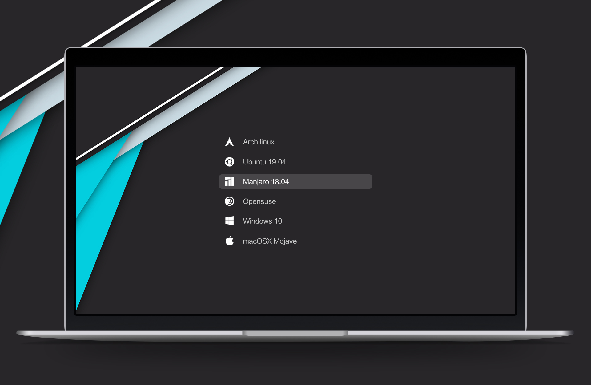

# 💻 Minha Configuração CachyOS Linux

[](./README.md)

Bem-vindo ao meu repositório pessoal de configurações para o **CachyOS**, uma distribuição Linux poderosa e otimizada baseada no Arch. Este repositório contém minhas configurações personalizadas, ferramentas e dicas para transformar seu ambiente Linux em uma máquina de produtividade.


---

## 🧠 Sobre o CachyOS

O CachyOS é uma distribuição Linux focada em desempenho baseada no Arch Linux. Ele oferece:

* ⚡ **Desempenho otimizado** com o escalonador BORE e compilação com flags de performance
* 🧰 **Instalador gráfico amigável** com KDE Plasma e outros ambientes
* 🔄 **Rolling Release** com o ecossistema bleeding-edge do Arch
* 📦 Acesso ao AUR, Flatpak, Snap e pacotes nativos
* 🎨 Temas e personalização bonitos prontos para uso

**Lançamento inicial**: 2022
**Site**: [https://cachyos.org](https://cachyos.org)

---

## 🛠️ Visão Geral do Meu Sistema

* **SO**: CachyOS (base Arch)
* **DE**: GNOME
* **Terminal**: `kitty` com tema Dracula
* **Editor de Texto**: VS Code com `settings.json` customizado
* **Fontes**: FiraCode Nerd Font

---

## 🎨 Extensões do GNOME para Personalização

Para customizar meu ambiente GNOME, uso o **Extension Manager** com as seguintes extensões:

- 🪄 **Compiz alike magic lamp effect**: Adiciona o famoso efeito "lâmpada mágica" ao minimizar janelas, onde elas se contraem de forma fluida em direção ao dock/taskbar, lembrando o efeito clássico do Compiz.

- ✨ **Compiz windows effect**: Traz de volta os icônicos efeitos de janela do Compiz, incluindo animações suaves de abertura/fechamento e transições elegantes entre workspaces.

- 🚀 **Dash2Dock Animated**: Transforma o dash padrão do GNOME em um dock animado e personalizável, similar ao macOS, com efeitos de hover, transparência e animações fluidas.

- 🧊 **Desktop Cube**: Cria o clássico efeito de cubo 3D para alternar entre workspaces, permitindo uma navegação visual impressionante entre diferentes áreas de trabalho.

- 🗂️ **Tiling Shell**: Adiciona funcionalidades de gerenciamento automático de janelas (tiling), organizando automaticamente as janelas em layouts eficientes sem sobreposição.

> 💡 **Dica**: Instale o Extension Manager via Flatpak ou pacman para gerenciar facilmente essas extensões.

<div align="center">
  
</div>

---

## 📥 Como Instalar o CachyOS (Recomendado com Ventoy)

1. **Baixe o ISO do CachyOS** em [https://cachyos.org/download](https://cachyos.org/download)
2. **Instale o Ventoy**:
   - **No Windows**:
     1. Baixe o Ventoy em [https://www.ventoy.net/en/download.html](https://www.ventoy.net/en/download.html)
     2. Extraia o arquivo ZIP
     3. Execute `Ventoy2Disk.exe` como administrador
     4. Selecione seu pendrive e clique em "Install"
   - **No Linux**:
     ```bash
     sudo bash Ventoy2Disk.sh -i /dev/sdX
     ```
     *(Substitua `/dev/sdX` pelo seu dispositivo USB)*
3. **Copie o ISO** para o pendrive Ventoy apenas arrastando e soltando
4. **Dê boot pelo USB** e siga o instalador gráfico do CachyOS

> ⚠️ **Atenção**: Certifique-se de selecionar o dispositivo USB correto para evitar perda de dados!

---

## 💡 Personalização do Ventoy e GRUB

Além do instalador padrão, uso uma interface personalizada do Ventoy com o tema [Grub-theme-vimix](https://www.gnome-look.org/p/1009236), deixando o menu de boot mais bonito e moderno.

Existem várias formas de aplicar essa personalização, mas segui o tutorial deste vídeo: [YouTube - Como personalizar o Ventoy com tema Vimix](https://www.youtube.com/watch?v=CuonyS3xdwg).

<div align="center">
  
</div>

---

## 🧾 Minhas Configurações do VS Code

Você pode abrir as configurações do usuário do VS Code pressionando:

```bash
Ctrl + Shift + P → Preferences: Open Settings (JSON)
```

Cole o seguinte:

```json
{
    // Arquivos e salvamento
    "files.autoSave": "off",
    "window.confirmSaveUntitledWorkspace": false,

    // Aparência do editor
    "editor.fontSize": 16,
    "editor.tabSize": 4,
    "editor.cursorSmoothCaretAnimation": "on",
    "editor.cursorBlinking": "phase",
    "editor.renderLineHighlight": "gutter",
    "editor.parameterHints.enabled": false,
    "breadcrumbs.enabled": true,

    // Terminal
    "terminal.integrated.fontSize": 16,

    // Interface do VS Code
    "workbench.iconTheme": "material-icon-theme",
    "workbench.activityBar.location": "top",
    "workbench.startupEditor": "none",
    "explorer.confirmDelete": false,
    "explorer.confirmDragAndDrop": false
}
```

---

## 🐱 Terminal: kitty

Eu uso o `kitty` como meu terminal com:

* Fonte: `FiraCode Nerd Font`
* Tamanho da fonte: `16.0`
* Tema: `Dracula`
* Transparência e atalhos personalizados

<div align="center">
  
</div>

Para configurar:

```bash
mkdir -p ~/.config/kitty
nano ~/.config/kitty/kitty.conf
```

Exemplo de trecho do `kitty.conf`:

```conf
# Tamanho da fonte
font_family      FiraCode Nerd Font
bold_font        auto
italic_font      auto
font_size        16.0

# Tema
include dracula.conf

# Atalhos úteis
map ctrl+shift+n new_os_window
map ctrl+shift+enter new_window

# Cores da borda do terminal
background_opacity 0.75
window_padding_width 5
```

---
